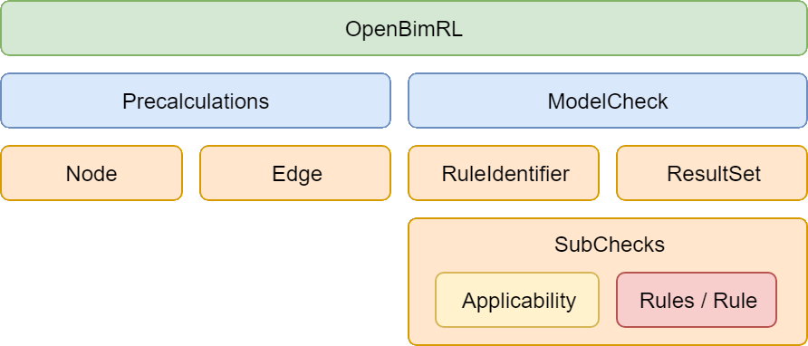

# OpenBimRL

> **Schema:** XSD <br>
> **Current Version:** 0.1 <br>
> **First Publication Date:** 10.06.2022 <br>
> **Autors:** Marcel Stepien, Andre Vonthron <br>
> **E-Mail:** marcel.stepien@ruhr-uni-bochum.de <br>
> **Licence:** MIT (Java-Sources), CC-BY-4.0 (XSD Schema)
<br>

## 1. Description

Based on the idea of graph-based programming, the OpenBimRL format describes a rule language for the formal and functional verification of building models. The format defines a dynamically extendable interface on the basis of which building blocks for a graph-based verification process can be constructed and linked. During the development, emphasis was placed on the openness and transparency of the verification documents. In contrast to most available rule and query languages, it is possible to check both semantics and geometry, as long as the available engine can resolve the associated nodes and edges of the precalculation.

## 2. Structure of the scheme and components



> The OpenBimRL concept is made up of several building blocks, which forms the general structure the schema.

### 2.1 OpenBimRL Schema
The main component of an OpenBimRL verification rule is called _BIMRule_, which specifies the format of the rule. It is the enclosing element in the verification document. The following information must be given as a minimum:

| Element.Attribut | Description | Example |
| ---      | ---          | ---      |
| BIMRule.schemaVersion   | Specification of the version with which the current test was generated. | 0.1   |

| Namespace | URI | 
| ---      | ---          | 
| default   | http://inf.bi.rub.de/OpenBimRL |
| xsi   | http://www.w3.org/2001/XMLSchema-instance |
| schemaLocation   | https://github.com/RUB-Informatik-im-Bauwesen/OpenBimRL/blob/main/schema/OpenBimRL.xsd |

**Translated as XML instance:**
```
<BIMRule 
    schemaVersion="0.1" 
    xmlns="http://inf.bi.rub.de/OpenBimRL" 
    xmlns:xsi="http://www.w3.org/2001/XMLSchema-instance"
    xsi:schemaLocation="https://github.com/RUB-Informatik-im-Bauwesen/OpenBimRL/blob/main/schema/OpenBimRL.xsd">

    ...

</BIMRule>

```

#### 2.2 Precalculations
The precalculations contain a graph with functions (as nodes) and a connection between inputs and outputs (as edges). The graph represents a process and/or algorithm, whose partial results can be stored temporarily for use in rules for model checking.

**Translated as XML instance:**
```
<BIMRule 
    schemaVersion="0.1" 
    xmlns="http://inf.bi.rub.de/OpenBimRL" 
    xmlns:xsi="http://www.w3.org/2001/XMLSchema-instance"
    xsi:schemaLocation="http://inf.bi.rub.de/OpenBimRL OpenBimRL.xsd">

    <!-- Precalculations contain a graph for pre-calculating subsets and results for the exam. -->
    <Precalculations>

        <Node> ... </Node>
        <Node> ... </Node>
        <Node> ... </Node>

        <Edge ... />
        <Edge ... />
        <Edge ... />

    </Precalculations>

    ...

</BIMRule>
```

##### 2.2.1 Nodes (functions)

Each node element contains _input_ and _output_ elements. Their attributes describe how many inputs and outputs are present and how they are named. However, inputs and outputs are only optional. A non-existence of these means that there are no inputs or outputs for this node. A node is therefore defined as follows:

| Element.Attribut | Description | Example |
| ---      | ---          | ---      |
| Node.id | Unique identifier of the node (UUID). | f2f87b48-108e-4f38-1328-7e8924d89738 |
| Node.function | Name and path of the function this node executes. | ifc.filterByProperty |
| Node.alias | A user-defined text describing the node. | Example Text Here |
| Input.name | Display name of the input. | PropertySetName |
| Output.name | Display name of the output. | IfcElement List |
| Output.value | User-defined value of the output. | Pset_WallCommon |

**Translated as XML instance:**
```
<!-- Node without entrance: -->
<Node id="25525f88-07e7-740b-7a79-d2294af8687a" function="input.textInput">
    <Outputs>
        <Output name="text" value="NotwendigerFlur"/>
    </Outputs>
</Node>

<!-- Node with input and output: -->
<Node id="f3d898d8-b958-3d79-084c-cce953f4b168" function="ifc.filterByProperty" alias="Example Text Here">
    <Inputs>
        <Input name="IfcElement List"/>
        <Input name="PropertySet Name"/>
        <Input name="Property Name"/>
        <Input name="Value"/>
    </Inputs>
    <Outputs>
        <Output name="IfcElement List"/>
    </Outputs>
</Node>
```

##### 2.2.2 Edges ( connections/relations)

An edge always connects an output of a node (function) with the input of another node (function). No cycles may occur here! **The graph is only valid for directed non-cyclic definitions.** An edge is defined as follows:

| Element.Attribut | Description | Example |
| ---      | ---          | ---      |
| Edge.id | Unique identifier of the edge (UUID). | f2f87b48-108e-4f38-1328-7e8924d89738 |
| Edge.source | Unique identifier of the outgoing referenced node (UUID). | 25525f88-07e7-740b-7a79-d2294af8687a |
| Edge.sourceHandle | Number of the addressed output, starting with 0. | 2 |
| Edge.target | Unique identifier of the incoming referenced node (UUID). | f3d898d8-b958-3d79-084c-cce953f4b168 |
| Edge.targetHandle | Number of the addressed input, starting at 0.  | 1 |

**Translated as XML instance:**
```
<Edge 
    id="ba4d8538-209d-48a8-5165-6c813e164ba1" 
    source="25525f88-07e7-740b-7a79-d2294af8687a" 
    sourceHandle="0" 
    target="f3d898d8-b958-3d79-084c-cce953f4b168" 
    targetHandle="3"/>
```

### 2.3 ModelCheck (model test)
The _ModelCheck_ component summarises all conditions and expected values of the checking rule. The _ModelCheck_ component itself defines a unique and descriptive name of the checking rule via the _name_ attribute. A ModelCheck is composed of three sub-components, namely the _RuleIdentifier_, _ModelSubCheck_ and _ResultSet_.

**Translated as XML instance:**
```
</tns:BIMRule>
    ...
    <tns:ModelCheck name="Formeller Pruefvorgang">
		<tns:RuleIdentifiers>
			<tns:RuleIdentifier label="propertyValue" source="85d5009c-f8dc-1ccf-66c8-ce610713793a" sourceHandle="0"/>
			<tns:RuleIdentifier label="ifcWallEntities" source="bc2a7431-9376-db5d-a12a-fe48e83bddbd" sourceHandle="0"/>
            ...
		</tns:RuleIdentifiers>
		<tns:ModelSubChecks>
			<tns:ModelSubCheck name="Check PropertySet by Values">
                <tns:Applicability> ... </tns:Applicability>
				<tns:Rules label="77dd6850-f1d7-4c13-81e0-2de33fbf06cc" operator="or">
					<tns:Rule label="check01" quantifier="exists" operator="equals" operand1="propertyValue" operand2="true"/>
					<tns:Rule label="check02" quantifier="exists" operator="equals" operand1="propertyValue" operand2="false"/>
				</tns:Rules>
			</tns:ModelSubCheck>
            ...
		</tns:ModelSubChecks>
		<tns:ResultSets>
			<tns:ResultSet name="PropertySet by Values [true]" elements="ifcWallEntities" filter="check01"/>
			<tns:ResultSet name="PropertySet by Values [false]" elements="ifcWallEntities" filter="check02"/>
            ...
		</tns:ResultSets>
	</tns:ModelCheck>
</tns:BIMRule>
```

##### 2.3.1 RuleIdentifier for linking the check to the precalculation
A _RuleIdentifier_ establishes a connection between the graph of the precalculation (_Precalculation_ component) and the rules applied to it. A _RuleIdentifier_ temporarily stores a calculated result from the graph in order to examine it in more detail linked by conditions. Accordingly, the source must be specified for a _RuleIdentifier_, explicit to the selected output. 

| Element.Attribut | Description | Example |
| ---      | ---          | ---      |
| RuleIdentifier.label | Unique term under which the RuleIdentifier is used in the rule check. | ifcWallEntities |
| RuleIdentifier.source | Unique identifier of the outgoing referenced node (UUID). | bc2a7431-9376-db5d-a12a-fe48e83bddbd |
| RuleIdentifier.sourceHandle | Number of the addressed output, starting with 0. | 0 |

##### 2.3.2 ModelSubCheck for nesting multiple rules and conditions 
A _ModelSubCheck_ summarises a group of individual requirements and allows them to be evaluated as a single test. The sub-check can be given a name separate from the main check via the _label_ attribute. Such a _ModelSubCheck_ consists of two main parts, _Applicability_ and _Rules_. 

The _Applicability_ is an optional component which itself contains a cascade of _Rules_ and _Rule_ components. The _Applicability_ can be used to apply a filter prior to rule checking. Only a set of valid elements are processed in the rule checking.

The rules and rule components are a cascading structure of grouped conditions. Individual rules (rule component) and groups of rules (rules component) can be nested to test more complex relationships. Usually, a list of information (as _operand1_) is always tested against static values (as _operand2_). This produces a test result as a filter mask, consisting of a list of _True_ and _False_ values, which can be intermediately held via a designation of the attribute _label_ in the ResultSets. The _quantifier_ and _operator_ attributes are used to set the logical constraints so that it can be determined whether the check can be completed successfully.

| Element.Attribut | Description | Example |
| ---      | ---          | ---      |
| Rule.label | A unique name under which the filter mask is referenced in the result sets. | filterMaskA |
| Rule.quantifier | The quantifier to be used to control the test procedure. | all, exists, notexists |
| Rule.operator | The operator to use to control the testing process. | equals, includes, notincludes |
| Rule.operator1 | A list of values that are injected into the check via the RuleIdentifier. | propertyValue |
| Rule.operator2 | A static value to be checked against. | feuerbeständig |
| Rule2.operator | The operator to be used for Boolean operations, for linking the partial results. | or, and, xor |

##### 2.3.3 ResultSet for the representation of expected partial results
A _ResultSet_ allows elements from the pre-calculation to be filtered with partial results of the check, creating views (Model Views) on successfully and unsuccessfully checked elements. This is made possible by applying filter masks to a set of testable elements. A _ResultSet_ requires three attributes for definition, which are a _name_, _elements_ and _filter_.

| Element.Attribut | Description | Example |
| ---      | ---          | ---      |
| ResultSet.name | Clear designation under which the results of the test are to be understood. | Erfolgreich geprüfte Elemente nach XYZ |
| ResultSet.elements | The list of testable elements from the precalculation. | ifcWallEntities |
| ResultSet.filter | The reference to the applicable filter mask from the test procedure. | filterMaskA |

## 3. Terms and definitions

**Query language** is a language construct derived from logic and grammatics, which forms the basis for declarative programming. In a query language, relationships of information are mapped and their conclusions are derived according to available facts. A query operates on a data basis (database). Its execution generates subsets (views, selections) of objects and information from the data basis.

**Rule language** is the logical extension of query languages and make it possible to derive a statement to an unambiguous result of *true* or *false*. At the core of rule languages are therefore always questions that can be derived to an unambiguous state.

**Graphs** are constructs consisting of nodes and edges, which in combination represent a network of information and information flows. Here we speak of directed graphs, not cyclic ones, which expect unique values for the input and produce an output.

**Formal check** refers to the proper attribution of a model according to the existing standard. This includes the typification and existence of properties on the model, according to the specifications of guidelines and standards.

In the **functional check**, it is necessary to prove the information supply of the existing and properly modeled building models. The technical specifications of the standards and guidelines are implemented algorithmically and their results are compared with the information in the model. Often a complex concatenation of information is necessary for this (see definition of graphs).

In the context of OpenBimRL, **building models** are always BIM-based models in the Industry Foundation Classes (IFC) format. IFC is a construct of classes that define a digital building.

The term **semantics** is understood to mean descriptive information about a building component, which is predominantly aimed at the textual definition of individual pieces of information. However, semantic information is not necessarily bound to an object, so structural specifications (building > storey > room) can also be interpreted as semantic information. 

**Geometry** is the representation and position of an object in a global space. Geometric distortions, transformations, and operators can also be used to generate statements from the set (for example, the intersection between two or more objects = collision). Geometry is usually used to derive parameters from its representation.
