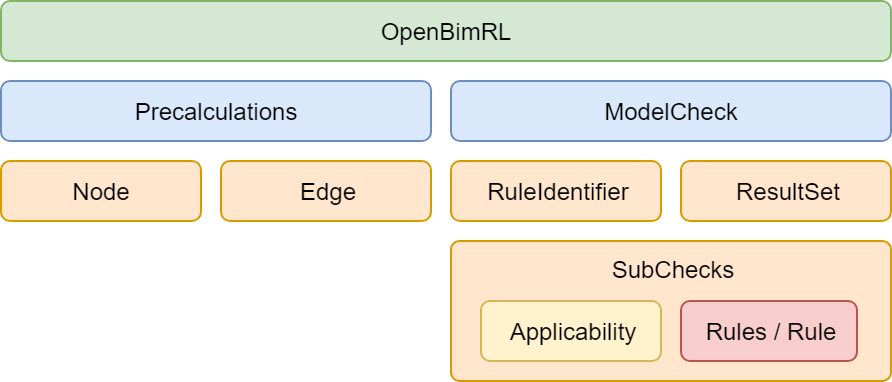

# OpenBimRL

> **Schema:** XSD <br>
> **Current Version:** 2022.11.1 <br>
> **Publication Date:** 10.06.2022 <br>
> **Autors:** Marcel Stepien, André Vonthron <br>
> **E-Mail:** marcel.stepien@ruhr-uni-bochum.de
> **Licence:** MIT (Java-Sources), CC-BY-4.0 (XSD Schema)
<br>

## 1. Beschreibung

Angelehnt an der graphenbasierten Programmierung (bspw. Dynamo und Grasshopper) beschreibt das OpenBimRL Format eine Regelsprache zur formellen und fachlichen Prüfung von Bauwerksmodellen. Das Format definiert eine dynamisch erweiterbare Schnittstelle, auf derer Basis Bausteine für einen graphenbasierten Prüfvorgang konstruiert und verknüpft werden können. Bei der Entwicklung wurde Wert auf Offenheit und Transparenz der Prüfungsdokumente gelegt. Im Gegensatz zu den meisten verfügbaren Regel- und Abfragesprachen ist es möglich sowohl Semantik als auch Geometrie zu prüfen, solange die verfügbare Engine die dazugehörigen Knoten und Kanten der Vorberechnung auflösen kann.

## 2. Aufbau des Schemas und der Komponenten



> Das OpenBimRL Konzept setzt sich aus mehreren Bausteinen zusammen, welche in Kombination das Schema des Formats darstellen. 

### 2.1 OpenBimRL Schema
Die Hauptkomponente einer OpenBimRL Prüfregel nennt sich _BIMRule_, welche das Format der Regel vorgibt. Es handelt sich dabei um das umschließende Element im Prüfdokument. Folgende Angaben sind hierbei mindestens anzugeben:

| Element.Attribut | Beschreibung | Beispiel |
| ---      | ---          | ---      |
| BIMRule.schemaVersion   | Angabe der Version mit welcher die vorliegende Prüfung erzeugt wurde. | 0.1   |

| Namespace | URI | 
| ---      | ---          | 
| default   | http://inf.bi.rub.de/OpenBimRL |
| xsi   | http://www.w3.org/2001/XMLSchema-instance |
| schemaLocation   | https://github.com/RUB-Informatik-im-Bauwesen/OpenBimRL/blob/main/schema/OpenBimRL.xsd |

**Übersetzt als XML-Instanz:**
```
<BIMRule 
    schemaVersion="0.1" 
    xmlns="http://inf.bi.rub.de/OpenBimRL" 
    xmlns:xsi="http://www.w3.org/2001/XMLSchema-instance"
    xsi:schemaLocation="https://github.com/RUB-Informatik-im-Bauwesen/OpenBimRL/blob/main/schema/OpenBimRL.xsd">

    ...

</BIMRule>

```

#### 2.2 Precalculations (Vorberechnung)
Die Vorberechnungen enthalten einen Graphen mit Funktionen (als Knoten) und eine Verbindung zwischen Ein- und Ausgängen (als Kanten). Der Graph bildet dabei einen Vorgang und/oder Algorithmus ab, dessen Teilergebnisse zwischengehalten werden können, um diese in den Regeln der Modellprüfung zu verwenden. 

**Übersetzt als XML-Instanz:**
```
<BIMRule 
    schemaVersion="0.1" 
    xmlns="http://inf.bi.rub.de/OpenBimRL" 
    xmlns:xsi="http://www.w3.org/2001/XMLSchema-instance"
    xsi:schemaLocation="http://inf.bi.rub.de/OpenBimRL OpenBimRL.xsd">

    <!-- Precalculations enthalten einen Graphen zur Vorberechnung von Teilmengen und Ergebnissen für die Prüfung. -->
    <Precalculations>

        <Node> ... </Node>
        <Node> ... </Node>
        <Node> ... </Node>

        <Edge ... />
        <Edge ... />
        <Edge ... />

    </Precalculations>

    ...

</BIMRule>
```

##### 2.2.1 Knoten (Funktionen)

Jedes Knoten-Element enthält _input_ und _output_-Elemente, dessen Attribute beschreiben, wie viele Ein- und Ausgänge vorhanden sind und wie diese benannt sind. Inputs und outputs sind jedoch nur optional. Ein nicht vorhanden sein dessen bedeutet, dass es keine Eingänge oder Ausgänge gibt für diesen Knoten. Ein Knoten definiert sich demnach wie folgt:

| Element.Attribut | Beschreibung | Beispiel |
| ---      | ---          | ---      |
| Node.id | Eindeutiger identifier des Knotens (UUID). | f2f87b48-108e-4f38-1328-7e8924d89738 |
| Node.function | Name und Pfad der Funktion, die dieser Knoten ausführt. | ifc.filterByProperty |
| Node.alias | Ein vom Nutzer definierter Text zur Beschreibung des Knotens. | Example Text Here |
| Input.name | Angezeige Name des Eingangs. | PropertySetName |
| Output.name | Angezeige Name des Ausgangs. | IfcElement List |
| Output.value | Nutzerdefinierter Wert des Ausgangs. | Pset_WallCommon |

**Übersetzt als XML-Instanz:**
```
<!-- Knoten ohne Eingang: -->
<Node id="25525f88-07e7-740b-7a79-d2294af8687a" function="input.textInput">
    <Outputs>
        <Output name="text" value="NotwendigerFlur"/>
    </Outputs>
</Node>

<!-- Knoten mit Ein- und Ausgang: -->
<Node id="f3d898d8-b958-3d79-084c-cce953f4b168" function="ifc.filterByProperty" alias="Example Text Here">
    <Inputs>
        <Input name="IfcElement List"/>
        <Input name="PropertySet Name"/>
        <Input name="Property Name"/>
        <Input name="Value"/>
    </Inputs>
    <Outputs>
        <Output name="IfcElement List"/>
    </Outputs>
</Node>
```

##### 2.2.2 Kanten (Verbindungen/Beziehungen)

Eine Kante verbindet immer einen Ausgang eines Knotens (Funktion) mit dem Eingang eines anderen Knotens (Funktion). Hierbei dürfen keine Zyklen definiert werden! **Der Graph ist nur für gerichtete, nicht zyklische Definitionen gültig.** Eine Kante wird wie folgt definiert:


| Element.Attribut | Beschreibung | Beispiel |
| ---      | ---          | ---      |
| Edge.id | Eindeutiger identifier der Kante (UUID). | f2f87b48-108e-4f38-1328-7e8924d89738 |
| Edge.source | Eindeutiger Identifier des ausgehenden referenzierten Knotens (UUID). | 25525f88-07e7-740b-7a79-d2294af8687a |
| Edge.sourceHandle | Nummer des adressierten Ausgangs, angefangen bei 0. | 2 |
| Edge.target | Eindeutiger identifier des eingehenden referenzierten Knotens (UUID). | f3d898d8-b958-3d79-084c-cce953f4b168 |
| Edge.targetHandle | Nummer des adressierten Eingangs, angefangen bei 0.  | 1 |

**Übersetzt als XML-Instanz:**
```
<Edge 
    id="ba4d8538-209d-48a8-5165-6c813e164ba1" 
    source="25525f88-07e7-740b-7a79-d2294af8687a" 
    sourceHandle="0" 
    target="f3d898d8-b958-3d79-084c-cce953f4b168" 
    targetHandle="3"/>
```

### 2.3 ModelCheck (Modellprüfung)
Die _ModelCheck_-Komponente fasst alle Bedingungen und Erwartungswerte der Prüfregel zusammen. Die _ModelCheck_-Komponente selbst definiert über das Attribut _name_ eine eindeutige und beschreibende Bezeichnung der Prüfregel. Ein ModelCheck setzt sich wiederum aus drei Sub-Komponenten zusammen, namentlich den _RuleIdentifier_, _ModelSubCheck_ und _ResultSet_.

**Übersetzt als XML-Instanz:**
```
</tns:BIMRule>
    ...
    <tns:ModelCheck name="Formeller Pruefvorgang">
		<tns:RuleIdentifiers>
			<tns:RuleIdentifier label="propertyValue" source="85d5009c-f8dc-1ccf-66c8-ce610713793a" sourceHandle="0"/>
			<tns:RuleIdentifier label="ifcWallEntities" source="bc2a7431-9376-db5d-a12a-fe48e83bddbd" sourceHandle="0"/>
            ...
		</tns:RuleIdentifiers>
		<tns:ModelSubChecks>
			<tns:ModelSubCheck name="Check PropertySet by Values">
                <tns:Applicability> ... </tns:Applicability>
				<tns:Rules label="77dd6850-f1d7-4c13-81e0-2de33fbf06cc" operator="or">
					<tns:Rule label="check01" quantifier="exists" operator="equals" operand1="propertyValue" operand2="true"/>
					<tns:Rule label="check02" quantifier="exists" operator="equals" operand1="propertyValue" operand2="false"/>
				</tns:Rules>
			</tns:ModelSubCheck>
            ...
		</tns:ModelSubChecks>
		<tns:ResultSets>
			<tns:ResultSet name="PropertySet by Values [true]" elements="ifcWallEntities" filter="check01"/>
			<tns:ResultSet name="PropertySet by Values [false]" elements="ifcWallEntities" filter="check02"/>
            ...
		</tns:ResultSets>
	</tns:ModelCheck>
</tns:BIMRule>
```

##### 2.3.1 RuleIdentifier zur Anknüpfung der Prüfung an die Vorberechnung
Ein _RuleIdentifier_ stellt eine Verbindung zwischen dem Graphen der Vorberechnung (_Precalculation_-Komponente) und den darauf angewandten Regeln her. Es wird durch ein _RuleIdentifier_ ein kalkuliertes Ergebnis aus dem Graphen zwischengespeichert, um diese durch Bedingungen verknüpft genauer zu untersuchen. Demnach müssen für einen _RuleIdentifier_ die Quelle angegeben werden, explizit zur ausgewählten Ausgabe (eng. output). 

| Element.Attribut | Beschreibung | Beispiel |
| ---      | ---          | ---      |
| RuleIdentifier.label | Eindeutige Bezeichnung, unter derer der RuleIdentifier in der Regelprüfung verwendet wird. | ifcWallEntities |
| RuleIdentifier.source | Eindeutiger Identifier des ausgehenden referenzierten Knotens (UUID). | bc2a7431-9376-db5d-a12a-fe48e83bddbd |
| RuleIdentifier.sourceHandle | Nummer des adressierten Ausgangs, angefangen bei 0. | 0 |

##### 2.3.2 ModelSubCheck zur Verschachtelung mehrerer Regeln und Bedingungen 
Ein _ModelSubCheck_ fasst eine Gruppe von individuellen Anforderungen zusammen und erlaubt es diese als eigenständige Prüfung zu evaluieren. Der Teilprüfung kann über das Attribut _label_ ein vom Haupt-Prüfvorgang separater Name verliehen werden. Solch ein _ModelSubCheck_ besteht aus zwei wesentlichen Teilen, der _Applicability_ (de. Anwendbarkeit) und _Rules_ (de. Regeln). 

Bei der _Applicability_ handelt es sich um eine optionale Komponente, welche selbst eine Kaskade von _Rules_ und _Rule_ Komponenten enthält. Durch die _Applicability_ kann zum Ausdruck gebracht werden, ob und auf was eine Prüfung angewandt wird. Es beschreibt also einen Gültigkeitsbereich für untersuchte Elemente im Prüfprozess.

Bei den Rules- und Rule-Komponenten handelt es sich um eine kaskadierende Struktur von gruppierten Bedingungen. Einzelne Regeln (Rule-Komponente) und Gruppen von Regeln (Rules-Komponente) können verschachtelt werden, um komplexere Zusammenhänge zu prüfen. Dabei wird in der Regel immer eine Liste von Informationen (als _operand1_) gegen statische Werte getestet (als _operand2_). Dabei entsteht ein Prüfergebnis als Filtermaske, bestehend aus einer Liste _True_ und _False_ Werten, welche über eine Bezeichnung des Attributs _label_ für die Darstellung in den ResultSets zwischengehalten werden kann. Über die Attribute _quantifier_ und _operator_ kann definiert werden, welche Mengen- und Prüfungsform gelten muss, damit die Prüfung erfolgreich abgeschlossen werden kann.

| Element.Attribut | Beschreibung | Beispiel |
| ---      | ---          | ---      |
| Rule.label | Eine eindeutige Bezeichnung, unter dessen Referenz die Filtermaske in den Resultsets verwendet wird. | filterMaskA |
| Rule.quantifier | Der anzuwendende Quantor zur Steuerung des Prüfvorgangs. | all, exists, notexists |
| Rule.operator | Der anzuwendende Operator zur Steuerung des Prüfvorgangs. | equals, includes, notincludes |
| Rule.operator1 | Eine Liste von Werten, welche über die RuleIdentifier in die Prüfung injekted werden. | propertyValue |
| Rule.operator2 | Ein statischer Wert, gegen den geprüft werden soll. | feuerbeständig |
| Rule2.operator | Der anzuwendende Operator für Boolsche-Operationen, zur Verknüpfung der Teilergebnisse. | or, and, xor |

##### 2.3.3 ResultSet zur Darstellung erwarteter Teilergebnisse
Ein _ResultSet_ ermöglicht es Elemente aus der Vorberechnung mit Teil-Ergebnissen der Prüfung zu filtern, wodurch Ansichten (Model Views) auf erfolgreich und nicht erfolgreich geprüfte Elemente erzeugt werden können. Dies wird möglich durch die Anwendung von Filtermasken auf eine Menge von prüfbaren Elementen, wodurch diese gefiltert wird. Ein _ResultSet_ benötigt drei Attribute zur Definition, welche da wären einen _name_, _elements_ und _filter_.

| Element.Attribut | Beschreibung | Beispiel |
| ---      | ---          | ---      |
| ResultSet.name | Eindeutige Bezeichnung, unter derer die Ergebnisse der Prüfung zu verstehen sind. | Erfolgreich geprüfte Elemente nach XYZ |
| ResultSet.elements | Die Liste von prüfbaren Elementen aus der Vorberechnung. | ifcWallEntities |
| ResultSet.filter | Die Referenz auf die anzuwendende Filtermaske aus dem Prüfvorgang. | filterMaskA |

## 3. Begriffe und Definitionen

**Abfragesprache** ist ein aus der Aussagenlogik und Grammatik entsprungenes Sprachkonstrukt, welche die Grundlage für die deklarative Programmierung bilden. In einer Abfragesprache werden Beziehungen von Informationen abgebildet und deren Schlussfolgerungen gemäß vorliegender Fakten abgeleitet. Eine Abfrage operiert auf einer Datengrundlage (Datenbank). Ihre Ausführung erzeugt dabei Teilmengen (Sichten, Selektionen) von Objekten und Informationen aus der Datengrundlage.

**Regelsprache** ist die logische Erweiterung von Abfragesprachen und ermöglichen es, eine Aussage zu einem eindeutigen Ergebnis von *Wahr* oder *Falsch* abzuleiten. Im Kern der Regelsprachen befinden sich demnach immer Fragestellungen, die zu einem eindeutigen Zustand abgeleitet werden können.

**Graphen** sind aus Knoten und Kanten bestehende Konstrukte, welche in Kombination ein Netzwerk an Informationen und Informationsflüssen abbilden. Hier wird dabei von gerichteten Graphen, nicht zyklischen gesprochen, welche eindeutige Werte für den Eingang erwarten und eine Ausgabe erzeugen.

Die **formale Prüfung** bezeichnet die ordnungsmäßige Attribuierung eines Modells nach vorliegender Norm. Dazu zählen die Typisierung und Existenz von Eigenschaften am Modell, nach den Vorgaben von Richtlinien und Normen.

Bei der **fachlichen Prüfung** gilt es, die Informationslieferung des vorhandenen und ordnungsmäßig modellierten Modells nachzuweisen. Die fachlichen Vorgaben der Normen und Richtlinien werden algorithmisch umgesetzt und deren Ergebnisse gegen die Angaben im Modell abgeglichen. Oftmals ist hierfür eine komplexe Verkettung von Informationen notwendig (siehe Definition von Graphen).

**Bauwerksmodelle** sind im Kontext von OpenBimRL immer BIM-basierte Modelle im Format der Industry Foundation Classes (IFC). Bei IFC handelt es sich wiederum um ein Konstrukt von Klassen zur Definition eines digitalen Bauwerks.

Als **Semantik** werden beschreibende Informationen zu einem Bauteil verstanden, welche überwiegend auf die textuelle Definition einzelner Informationen abzielt. Semantische Informationen sind jedoch nicht zwingend an ein Objekt gebunden, so können strukturelle Vorgaben (Gebäude > Etage > Raum) ebenfalls als semantische Information interpretiert werden. 

Bei der **Geometrie** handelt es sich um die Darstellung und Position eines Objekts im global betrachteten Raum. Hierbei können auch geometrische Verzerrungen, Transformationen und Operatoren genutzt werden, um Aussagen aus der Menge zu erzeugen (bspw. Intersection/Verschnitt zwischen zwei oder mehr Objekten = Kollision). Meistens wird die Geometrie genutzt, um Kenngrößen aus ihrer Darstellung abzuleiten.

